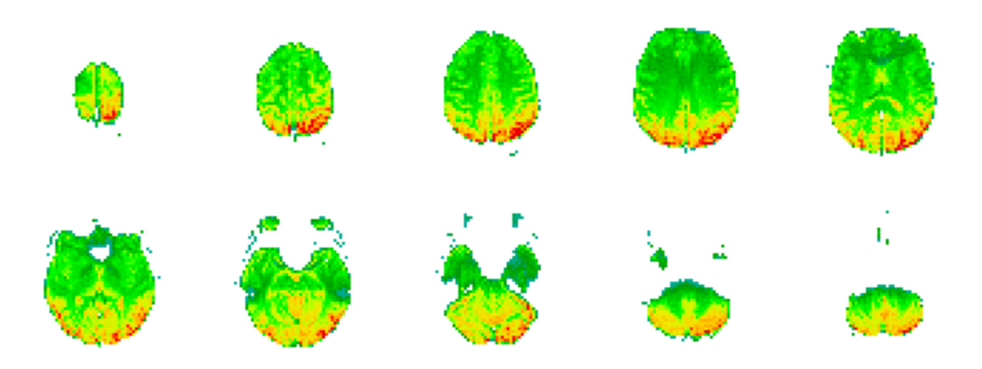

# EEG recoding to fMRI volume

In this post I will go over the procedure to project an EEG instance to an fMRI. This work is the core of my PhD thesis and all the findings that consequently followed. The motivation of synthesizing an fMRI volume from EEG rests on:
- An EEG recording setup is cheaper than an MRI laboratory setup;
- The fMRI recording session in itself costs hundreds of dollars, whereas an EEG recording does not;
- The main hypothesis of this work is to develop an informed fMRI view that allows better diagnosis than the EEG view alone, consequently having the potential of being applied in health care systems and reducing costs.

## What is the model?

In the [EEG to fMRI paper](https://arxiv.org/abs/2203.03481), the methodology to do this projection is presented. The architecture of this model is shown in the figure below.

<p align="center">
	
</p>

This model processes two inputs:
- EEG representation $$\vec{x} \in \mathbb{R}^{C \times F \times T}$$;
- fMRI volume representation $$\vec{y} \in \mathbb{R}^{M_1 \times M_2 \times M_3}$$.

## What is an EEG?

The EEG has a drift in relation to the associated fMRI volume, since it takes into consideration $$10\times \mbox{TR}$$ seconds in total (for the [NODDI](https://osf.io/94c5t/) dataset this corresponds to $$10\times 2.160=21.6$$ seconds). In addition, the EEG has $$C$$ channels and $$F$$ frequency coefficients. The figure below shows a representation of an EEG.

<p align="center">
	
</p>

## What is an fMRI?

On the other hand, we have a **single** fMRI volume associated with the respective EEG. This fMRI is described by three dimensions, corresponding to the 3-dimensional axis, where $$M_1=64$$, $$M_2=64$$ and $$M_3=30$$. The figure below shows an fMRI volume.

<p align="center">
	
</p>

## Let us dive our hands into the code! And the mathematics behind it!

In terms of code this corresponds to loading the data. First we start by import the necessary libraries:

```python
import tensorflow as tf
import numpy as np
import sys

sys.path.append("../src")

import os
os.environ['EEG_FMRI_DATASETS']="/home/david/eeg_to_fmri/datasets"
os.environ['EEG_FMRI']="/home/david/eeg_to_fmri"

import eeg_to_fmri
from eeg_to_fmri.utils import tf_config

dataset="01"
tf_config.set_seed(seed=2)
tf_config.setup_tensorflow(device="GPU", memory_limit=1500, run_eagerly=True)

from eeg_to_fmri.models.synthesizers import EEG_to_fMRI
from eeg_to_fmri.data import preprocess_data, eeg_utils, data_utils
from eeg_to_fmri.learning import train, losses
from eeg_to_fmri import metrics
from eeg_to_fmri.utils import viz_utils
```

Then we specify the number of individuals and $$T$$ (which corresponds to ```interval_eeg```), and load the data:

```python
n_individuals=getattr(data_utils, "n_individuals_"+dataset)
interval_eeg=10

with tf.device('/CPU:0'):
    train_data, test_data = preprocess_data.dataset(dataset, n_individuals=n_individuals, interval_eeg=interval_eeg, ind_volume_fit=False, standardize_fmri=True, iqr=False, verbose=True)
    eeg_train, fmri_train =train_data
    eeg_test, fmri_test = test_data
print(eeg_train.shape, fmri_train.shape)
print(eeg_test.shape, fmri_test.shape)
```
The print output corresponds to:
```
<<< (2296, 64, 134, 10, 1) (2296, 64, 64, 30, 1)
<<< (574, 64, 134, 10, 1) (574, 64, 64, 30, 1)
```

In total, we are using 2296 instances for training the model and 574 constitute the testing set. After this we can start building the model presented in the first figure. We first unroll the hyperparameters for the neural network: learning rate, weight decay, etc:

```python
from eeg_to_fmri.models.synthesizers import parameters
learning_rate,weight_decay ,kernel_size ,stride_size ,batch_size,latent_dimension,n_channels,max_pool,batch_norm,skip_connections,dropout,n_stacks,outfilter,local=parameters
```

Note that both the ```eeg_to_fmri.models.synthesizers.parameters``` and the neural architectures' specification were obtained after exhaustive automatic searches. For the first, the Bayesian optimization algorithm [\[1\]](#references) was used and for the second the automatic neural architecture generation algorithm [\[2\]](#references).

With these parameters, we can finally build the model and setup the optimizer, loss, training set and test set:

```python
from eeg_to_fmri.models.synthesizers import na_specification_eeg
from eeg_to_fmri.models.fmri_ae import na_specification_fmri

with tf.device('/CPU:0'):
    model = EEG_to_fMRI(latent_dimension, eeg_train.shape[1:], na_specification_eeg, n_channels,
                        weight_decay=weight_decay, skip_connections=True, batch_norm=True, fourier_features=True,
                        random_fourier=True, topographical_attention=True, conditional_attention_style=True,
                        conditional_attention_style_prior=False, local=True, seed=None, 
                        fmri_args = (latent_dimension, fmri_train.shape[1:], kernel_size, stride_size, n_channels, 
                        max_pool, batch_norm, weight_decay, skip_connections,
                        n_stacks, True, False, outfilter, dropout, None, False, na_specification_fmri))
    model.build(eeg_train.shape, fmri_train.shape)
    optimizer = tf.keras.optimizers.Adam(learning_rate)
    loss_fn = losses.mae_cosine
    train_set = tf.data.Dataset.from_tensor_slices((eeg_train, fmri_train)).batch(batch_size)
    test_set= tf.data.Dataset.from_tensor_slices((eeg_test, fmri_test)).batch(1)
```

Note that the loss used minimizes the objective of approximating the EEG with the fMRI, along with the latent representations of each other, meaning:

$$\mathcal{L}(\vec{x}, \vec{y}) = ||\vec{y}-\hat{y}||_1^1  + 1-\frac{\vec{z}_x \cdot \vec{z}_y}{||\vec{z}_x||_2^2\cdot ||\vec{z}_y||_2^2}$$

This loss ([code](https://github.com/DCalhas/eeg_to_fmri/blob/b4ab007aa85fef7c6c3d62b2e215e0131ee42f26/src/utils/losses_utils.py#L447)) approximates the output (predicted fMRI) with the ground truth (fMRI volume) using the L1 distance and approximates the latent representations with a pattern based (cosine) distance.

Finally, comes the fun part! The model is trained with the objective of producing an fMRI volume similar to the one paired with the given EEG:

```python
train.train(train_set, model, optimizer, loss_fn, epochs=10, u_architecture=True, val_set=None, verbose=True, verbose_batch=True)
```

The output, running this in my laptop, corresponds to:

```
<<< Epoch 1 with loss: 0.9473224575095891
<<< Epoch 2 with loss: 0.9166405657857968
<<< Epoch 3 with loss: 0.9102472579853045
<<< Epoch 4 with loss: 0.9070683614925225
<<< Epoch 5 with loss: 0.9040099402130273
<<< Epoch 6 with loss: 0.9051329443679038
<<< Epoch 7 with loss: 0.903896741543082
<<< Epoch 8 with loss: 0.8961787599719775
<<< Epoch 9 with loss: 0.8985048017435373
<<< Epoch 10 with loss: 0.8955792264448226
```

Now we have a trained model that given an EEG representation, gives us an fMRI volume. You can check the visualization by using the visualization utilities file available in this repository:

```python
for eeg, fmri in test_set.repeat(1):
    viz_utils.plot_3D_representation_projected_slices(model(eeg, fmri)[0].numpy()[0], threshold=0.37).show()
    break
```

The output of this code corresponds to the figure below. 

<p align="center">
	
</p>

Note that we give as input, to the model, the EEG and the fMRI representation, however our goal is to produce an fMRI volume without an EEG reference. If we check the [call function](https://github.com/DCalhas/eeg_to_fmri/blob/ff7c1b988a7dca77f0db400bcb511c6127e82c33/src/models/eeg_to_fmri.py#L329) of the model, we see that it returns a list of tensors, where the first tensor is the predicted fMRI without influence of the original fMRI and only dependent on the EEG. In the [next blog post](https://dcalhas.github.io/eeg_to_fmri/blog/Sinusoid_separation.html) I show you how to use the model trained in this post to obtain fMRI synthesized volumes and use them for classification.


## References

\[1\]: [Snoek, J., Larochelle, H., & Adams, R. P. (2012). Practical bayesian optimization of machine learning algorithms. Advances in neural information processing systems, 25.](https://proceedings.neurips.cc/paper/2012/hash/05311655a15b75fab86956663e1819cd-Abstract.html)

\[2\]: [Calhas, D., Manquinho, V. M., & Lynce, I. (2021, November). Automatic Generation of Neural Architecture Search Spaces. In Combining Learning and Reasoning: Programming Languages, Formalisms, and Representations.](https://openreview.net/forum?id=TCvkaP15O7e)