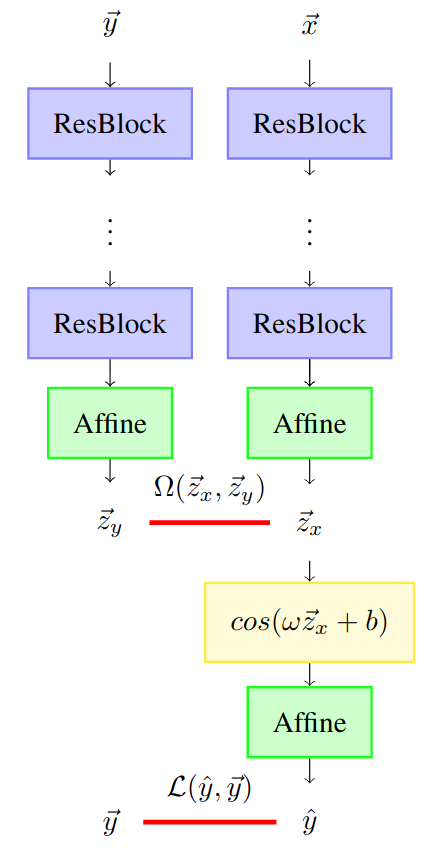
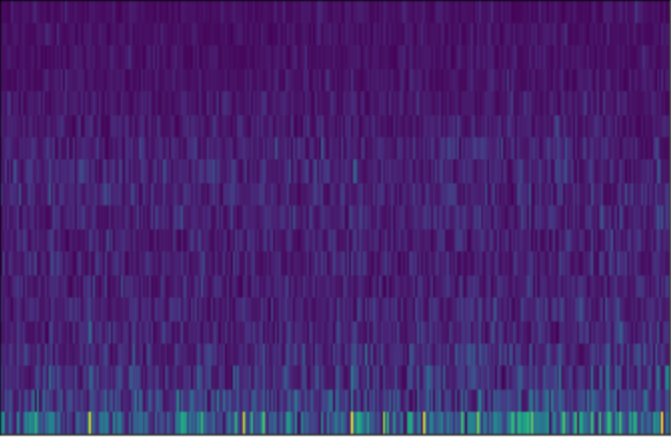
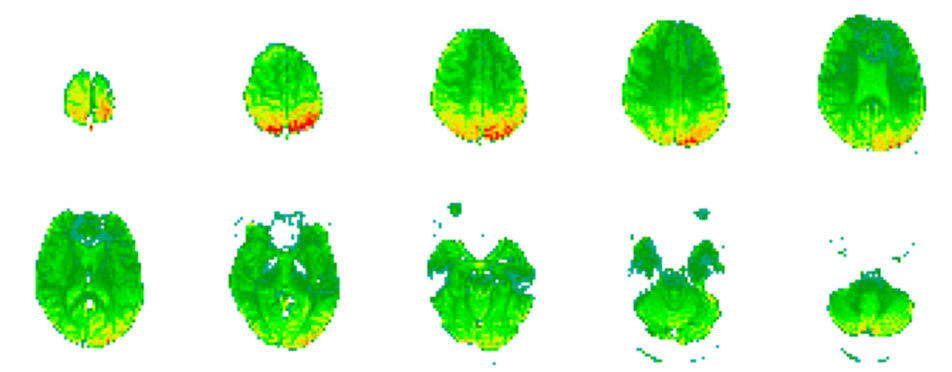

# EEG recoding to fMRI volume

In this post I will go over the procedure to project an EEG instance to an fMRI.

In the [EEG to fMRI paper](https://arxiv.org/abs/2203.03481), the methodology to do this projection is presented. The architecture of this model is shown in the Figure below.

	

This model processes two inputs:
- EEG representation $$\vec{x} \in \mathbb{R}^{C \times F \times T}$$;
- fMRI volume representation $$\vec{y} \in \mathbb{R}^{M_1 \times M_2 \times M_3}$$.

The EEG has a drift in relation to the associated fMRI volume, since it takes into consideration $$10\times \mbox{TR}$$ seconds in total (for the [NODDI](https://osf.io/94c5t/) dataset this corresponds to $$10\times 2.160=21.6$$ seconds). In addition, the EEG has $$C$$ channels and $$F$$ frequency coefficients. The figure below shows a representation of an EEG.

	

On the other hand, we have a **single** fMRI volume associated with the respective EEG. This fMRI is described by three dimensions, corresponding to the 3-dimensional axis, where $$M_1=64$$, $$M_2=64$$ and $$M_3=30$$. The figure below shows an fMRI volume.

	

