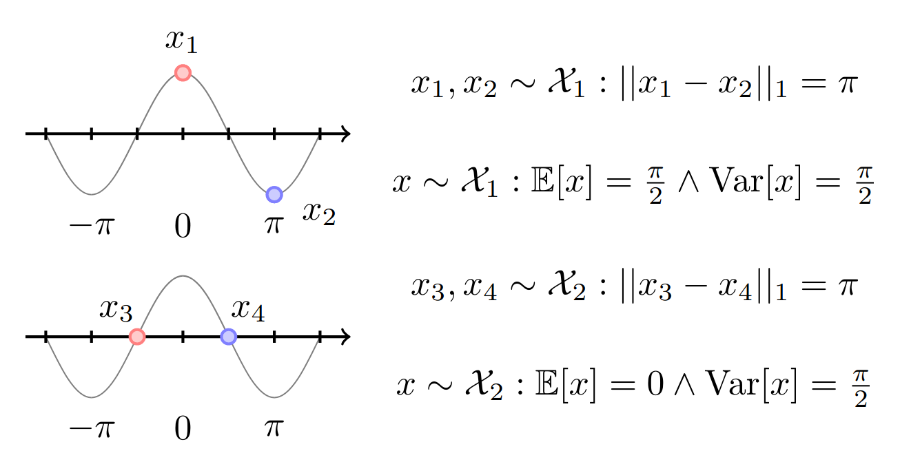

# Classification on EEG only datasets

In this post I will talk about an approach that is able to use sinusoids to generate images [[1](#references)], while being able to separate the data according to labels.

	

### Constrastive loss in the unit circle

	

### Bayesian versus Deterministic

	

## References

\[1\]: [Tancik, Matthew, et al. Fourier features let networks learn high frequency functions in low dimensional domains. Advances in Neural Information Processing Systems, 2020, 33: 7537-7547.](https://arxiv.org/abs/2006.10739)