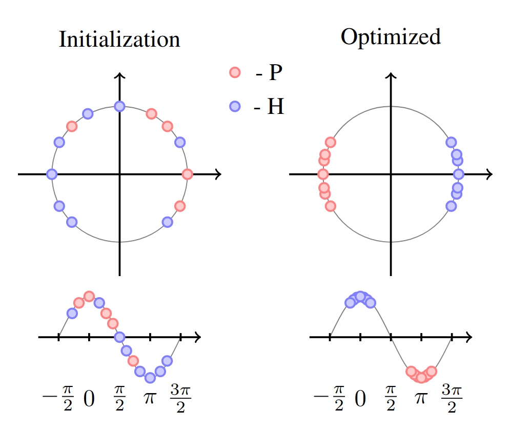

# Classification on EEG only datasets

In this post I will talk about the application of this package to classify EEG data. The purpose is to be able to classify an EEG alone, without an fMRI pairing, while being able to project a synthesized fMRI view.

## EEG only dataset

The dataset consists of $$N$$ individuals. The individuals have a set of features $$X \in \mathbb{R}^{N \times C\times F\times T}$$ and labels $$y \in \mathbb{R}^{N \times 1}$$. The notation is similar to the previous blog post, where $$C$$ stands for the number of channels, $$F$$ is the frequency resolution and $$T$$ is the amount of time considered of the EEG recording. Note that, we only consider binary classification problems for this setup. An EEG instance looks like illustrated in the figure below.

<p align="center">
	
</p>

This image corresponds to the STFT projection of one channel. The labels are $$y = \{0, 0, \dots, 1, 1\}$$.

## Classifying synthesized images

In this section, I will go over the methodology used to classify synthesized images (a projection that is done using the sinusoids). This is the novel contribution of this [paper](https://en.wikipedia.org/wiki/HTTP_404). It consists on picking the sinusoid projections $$cos(\omega \cdot \vec{z}_{X_i} + \beta)$$, with $$\omega,\beta$$ being trainable parameters, and separating both $$\omega \cdot \vec{z}_{X_i} + \beta$$ and $$cos(\omega \cdot \vec{z}_{X_i} + \beta)$$ using a contrastive loss. In the figure below it is shown how the points are initialized and how after training they are well separated in opposite sides of the unit circle, where the $$cos$$ takes values $$\approx 1$$ and $$\approx -1$$.

<p align="center">
	
</p>

The loss that achieves this goal is an adaptation of the [contrastive loss](),

$$\mathcal{L}_D(X_1, X_2, y_p) = y_p \times D(X_1, X_2) + (1-y_p) \times \|D(X_1,X_2)-m\|_1,$$

where $$X_1$$ and $$X_2$$ are the two instances that constitute the pair. The distance function is defined as $$D(X_i, X_j)=\|(\omega \cdot\vec{z}_{X_i} + \beta) -(\omega \cdot \vec{z}_{X_j} + \beta)\|_1$$ and $$y_p$$ specifies if these two instances belong together or not. Two instances belong together if $$y_i == y_j$$ and are false pairs if $$y_i \neq y_j$$. Therefore, $$y_p$$ can be represented as $$1[y_i == y_j]$$. The term $$y_p \times D(x_1, x_2)$$ brings points with the same label closer together, while them term $$(1-y_p) \times \|D(x_1,x_2)-m\|_1$$ places points with different labels as far as $$m$$, which we set to $$m=\pi$$.

## Let us dive into the code!

First you need to do all the imports:

```python
import tensorflow as tf
from utils import data_utils, preprocess_data, tf_config, train, losses_utils, lrp, viz_utils, fmri_utils
from layers import topographical_attention
from models import classifiers, eeg_to_fmri
from pathlib import Path
import numpy as np
import matplotlib.pyplot as plt
from pathlib import Path
import pickle
```

Then you set up the information about which dataset to use for the classification, for the synthesis, as well as setting up the seed for tensorflow and the memory limit it uses on the GPU.

```python
dataset="11"
dataset_synthesis="01"
raw_eeg=False
n_individuals=getattr(data_utils, "n_individuals_"+dataset)
memory_limit=1500
interval_eeg=10
tf_config.set_seed(seed=2)
tf_config.setup_tensorflow(device="GPU", memory_limit=memory_limit, run_eagerly=True)
```

For this classification setting, we always assume that a CV with $$n$$ folds is being performed, but here we simply do one fold. That is why the number of folds is being set, but only one of them is being considered ```train_data, test_data = dataset_clf_wrapper.split(0)```.

```python
with tf.device('/CPU:0'):	
	dataset_clf_wrapper = preprocess_data.Dataset_CLF_CV(dataset, standardize_eeg=True, load=True)
	dataset_clf_wrapper.shuffle()
	dataset_clf_wrapper.set_folds(5)
	train_data, test_data = dataset_clf_wrapper.split(0)
	X_train, y_train=train_data
	X_test, y_test=test_data
```

With the train and test data, which formulate the pairs of data $$X, y$$, with its corresponding features and labels we are set. Wait, we still need a special type of pairing for the training, since we are minimizing the contrastive loss. That means we need pairs of instances $$i, j$$, where for each batch introduced in the model we need their features $$X_i, X_j$$, labels $$y_i, y_j$$ and pair label $$y_p = 1[y_i==y_j]$$. In the end each batch of the ```train_set``` contains tuples of the form $$(X_i, X_j, y_p, y_i, y_j)$$.

```python
train_set = preprocess_data.DatasetContrastive(X_train, y_train, batch=8, clf=True)
test_set = tf.data.Dataset.from_tensor_slices((X_test, y_test)).batch(1)
```

Why do we need the labels $$y_i, y_j$$? Because in addition to separating the data according to the contrastive loss, we are also learning a linear classifier that classifies the synthesized fMRI view. This loss is represented as 

$$\mathcal{L}_C = y_i\times log(\hat{y}_i) + y_j\times log(\hat{y}_j),$$

where both instances are used for the training of the classifier. Altogether, these losses form the main loss

$$\mathcal{L}(X_i, X_j, y_p, y_i, y_j) = \mathcal{L}_D(X_i, X_j, y_p) + \mathcal{L}_C(X_i, X_j, y_i, y_j) + \lambda\|\theta\|_1$$

## References

\[1\]: [Tancik, Matthew, et al. Fourier features let networks learn high frequency functions in low dimensional domains. Advances in Neural Information Processing Systems, 2020, 33: 7537-7547.](https://arxiv.org/abs/2006.10739)