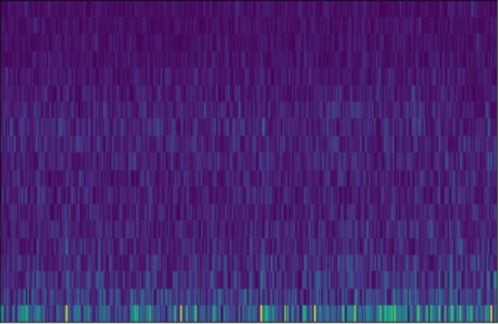

# Classification on EEG only datasets

In this post I will talk about the application of this package to classify EEG data. The purpose is to be able to classify an EEG alone, without an fMRI pairing, while being able to project a synthesized fMRI view.

## EEG only dataset

The dataset consists of $$N$$ individuals. Each individual has a set of features $$X \in \mathbb{R}^{N \times C\times F\times T}$$ and labels $$y \in \mathbb{R}^{N \times 1}$$. Note that, we only consider binary classification problems for this setup. An EEG instance looks like illustrated in the figure below.

	

This image corresponds to the STFT projection of one channel. The labels are $$y = \{0, 0, \dots, 1, 1\}$$.

## Classifying synthesized images

In this section, I will go over the methodology used to classify synthesized images (a projection that is done using the sinusoids). This is the novel contribution of this [paper](). It consists on picking the sinusoid projections $$cos(\omega \cdot \vec{z}_x + \beta)$$, with $$\omega,\beta$$ being trainable parameters, and separating both $$\omega \cdot \vec{z}_x + \beta$$ and $$cos(\omega \cdot \vec{z}_x + \beta)$$ using a contrastive loss. In the figure below it is shown how the points are initialized and how after training they are well separated in sides of the unit circle, where the $$cos$$ takes values $$\approx 1$$ and $$\approx -1$$.

	

## References

\[1\]: [Tancik, Matthew, et al. Fourier features let networks learn high frequency functions in low dimensional domains. Advances in Neural Information Processing Systems, 2020, 33: 7537-7547.](https://arxiv.org/abs/2006.10739)